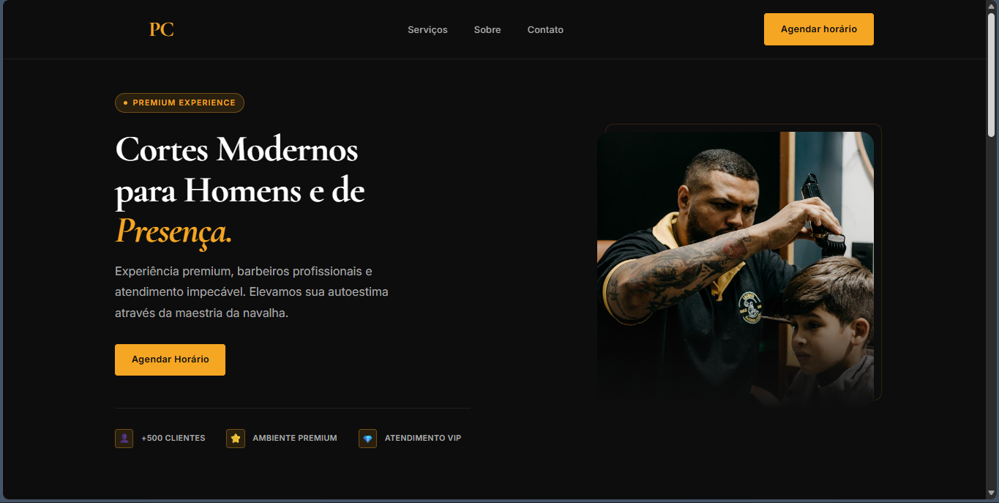

# PrimeCuts Barbershop

Landing page responsiva desenvolvida para uma barbearia premium fictícia, com foco em apresentação visual elegante, navegação fluida e experiência moderna em diferentes dispositivos.

## 🔗 Demo

Acesse o projeto online: [PrimeCuts Barbershop](https://prime-cuts-five.vercel.app/)

## 📸 Preview




## ✨ Sobre o projeto

O **PrimeCuts Barbershop** é um projeto de portfólio desenvolvido com o objetivo de praticar e demonstrar habilidades em:

- estruturação semântica com HTML5
- estilização com CSS3
- responsividade
- organização de arquivos por componentes
- interações com JavaScript puro
- atenção a detalhes visuais e experiência do usuário

A proposta foi criar uma landing page moderna para uma barbearia premium, com identidade visual sofisticada e navegação intuitiva.

---

## 🚀 Tecnologias utilizadas

- HTML5
- CSS3
- JavaScript (ES Modules)

---

## 🎯 Funcionalidades

- Layout responsivo
- Navbar fixa
- Menu mobile com botão hambúrguer
- Hero section
- Cards de serviços
- Seções organizadas para serviços, sobre, agendamento e contato
- CTA para agendamento via WhatsApp
- Estrutura semântica e boas práticas de acessibilidade
- Metadados para SEO e compartilhamento social

---

## 📁 Estrutura do projeto

```bash
primecuts-barbershop/
├── assets/
│   ├── icons/
│   └── images/
├── css/
│   ├── components/
│   ├── utils/
│   └── style.css
├── js/
│   ├── components/
│   └── main.js
├── index.html
└── README.md